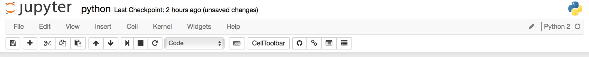

# Setting up GIST for jupyter

## Installation

To install, simply run:

*Mac OSX*

```
pip install jupyter-notebook-gist
jupyter serverextension enable --py jupyter_notebook_gist
sudo jupyter nbextension install --py jupyter_notebook_gist
jupyter nbextension enable --py jupyter_notebook_gist
jupyter nbextension enable --py widgetsnbextension
```

*Window*

```
pip install jupyter-notebook-gist
jupyter serverextension enable --py jupyter_notebook_gist
jupyter nbextension install --py jupyter_notebook_gist
jupyter nbextension enable --py jupyter_notebook_gist
jupyter nbextension enable --py widgetsnbextension
```

To double-check if the extension was correctly installed run:

```
jupyter nbextension list
```

Expected to see (Mac OSX):

```
Known nbextensions:
  config dir: /Users/Usr/.jupyter/nbconfig
    notebook section
      jupyter-js-widgets/extension  enabled
      - Validating: OK
      jupyter-notebook-gist/extension  enabled
      - Validating: OK
  config dir: /Users/Usr/anaconda/etc/jupyter/nbconfig
    notebook section
      jupyter-js-widgets/extension  enabled
      - Validating: OK
```

Expected to see (Window):

```
Known nbextensions:
  config dir: C:\Users\Usr\.jupyter\nbconfig
    notebook section
      jupyter-js-widgets/extension enabled
      - Validating: ok
      jupyter-notebook-gist/extension enabled
      - Validating: ok
  config dir: C:\Users\Usr\Anaconda2\etc\jupyter\nbconfig
    notebook section
      nb_anacondacloud/main enabled
      - Validating: ok
      nb_conda/main enabled
      - Validating: ok
      jupyter-js-widgets/extension enabled
      - Validating: ok
      nbpresent/js/nbpresent.min enabled
      - Validating: ok
    tree section
      nb_conda/tree enabled
      - Validating: ok
```

To double-check if the extension was correctly installed run:

```
jupyter serverextension list
```

Expected to see (Mac OSX):

```
config dir: /Users/Usr/.jupyter
    jupyter_notebook_gist  enabled
    - Validating...
      jupyter_notebook_gist  OK
```

Expected to see (Window):

```
config dir: C:\Users\Usr\.jupyter
    jupyter_notebook_gist enabled
    - Validating...
      jupyter_notebook_gist  ok
config dir: C:\Users\Usr\Anaconda2\etc\jupyter
    nbpresent enabled
    - Validating...
      nbpresent  ok
    nb_conda enabled
    - Validating...
      nb_conda  ok
    nb_anacondacloud enabled
    - Validating...
      nb_anacondacloud  ok
```

## Configuration

Get your GitHub client id and secret. You can create one [here](https://github.com/settings/applications).

Here's an [example](https://cloud.githubusercontent.com/assets/969479/14916551/add90efc-0df0-11e6-8cfb-277754a48b66.png) of an OAuth application created by @mreid-moz for testing.

To run your notebok server:

```
jupyter notebook --NotebookGist.oauth_client_id="id_here" --NotebookGist.oauth_client_secret="secret_here"
```

You should be able to see there are 4 icons next to the `CellToolbar`




## Check

In case if you got `Unrecognized JSON config file` error...

Make sure the `notebook.json` under `~/.jupyter/nbconfig/` or `C:\Users\Usr\.jupyter\nbconfig` looks like the following:

```
{
  "oauth_client_id": "id_here", 
  "load_extensions": {
    "jupyter-js-widgets/extension": true, 
    "jupyter-notebook-gist/extension": true
  }, 
  "oauth_client_secret": "secret_here"
}
```